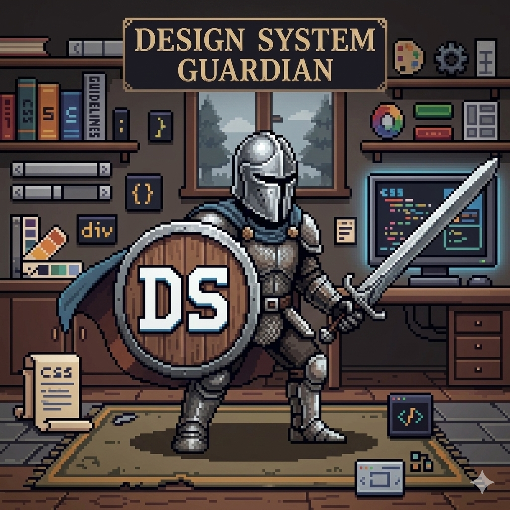

<p align="center">
  
</p>

# DS Guardian

**DS Guardian** is an AI-powered CLI tool for keeping your CSS in sync with your design system.

It does two things:

- **Refactor** — point it at a project with an existing `design-system.css` and it will replace hardcoded values with the correct CSS variables, letting you review every change before it's applied.
- **Extract** — point it at a codebase with no design system yet and it will analyze your CSS, identify recurring values, and generate a `design-system.css` for you.

Runs locally with [Ollama](https://ollama.com) (free, no API key) or with any cloud provider — Anthropic, OpenAI, or Google Gemini. Bring your own model.

---

## How it works

**Refactor mode** (`dsg start`)

1. **Scan** — finds all `.css`, `.scss`, `.sass`, and `.less` files in your target directory
2. **Process** — sends each file to the AI along with your `design-system.css` tokens
3. **Review** — presents a side-by-side diff for each changed file; accept, reject, or skip
4. **Apply** — writes accepted changes and creates timestamped backups of the originals

**Extract mode** (`dsg extract`)

1. **Scan** — finds all style files in your project
2. **Analyze** — the AI identifies hardcoded values and groups them into token categories
3. **Review** — you inspect the proposed tokens before anything is written
4. **Generate** — writes a ready-to-use `design-system.css` file

---

## Requirements

- Python 3.10+
- **One of the following AI backends:**
  - [Ollama](https://ollama.com) running locally (default, free, no API key)
  - Anthropic API key → Claude
  - OpenAI API key → GPT
  - Google AI API key → Gemini

---

## AI providers

|             | Local (Ollama)                                                     | Cloud (Anthropic / OpenAI / Gemini) |
| ----------- | ------------------------------------------------------------------ | ----------------------------------- |
| **Cost**    | Free                                                               | Pay-per-use                         |
| **Privacy** | Runs on your machine, nothing leaves                               | Code is sent to the provider's API  |
| **Quality** | Good with larger models, varies with smaller ones                  | Consistently strong results         |
| **Setup**   | Requires [Ollama](https://ollama.com) installed and a model pulled | Requires an API key                 |
| **Speed**   | Depends on your hardware                                           | Fast                                |

**Recommendation:** Start with Ollama if you want a free, private setup. Switch to a cloud provider if you need more reliable refactoring results or are working with a large codebase.

Run `dsg configure` to switch providers at any time.

---

## Installation

The recommended way to install DS Guardian is with [pipx](https://pipx.pypa.io), which installs the `dsg` command globally and manages the Python environment for you — no venv setup required.

```bash
# Install pipx if you don't have it
pip install pipx
pipx ensurepath

# Install DS Guardian
pipx install git+<repo-url>

# Verify setup (uses Ollama by default)
dsg check-setup

# Configure your AI provider (interactive wizard)
dsg configure
```

> **Using a cloud provider?** Install its SDK alongside DS Guardian:
>
> ```bash
> pipx install "git+<repo-url>[anthropic]"   # Claude
> pipx install "git+<repo-url>[openai]"       # GPT
> pipx install "git+<repo-url>[gemini]"       # Gemini
> ```

<details>
<summary>Manual install (pip + venv)</summary>

```bash
git clone <repo-url>
cd ds-guardian
python -m venv venv
source venv/bin/activate  # Windows: venv\Scripts\activate
pip install -e .
```

</details>

---

## Usage

```bash
# Pre-flight summary: see what dsg start will do before running it
dsg info
dsg info /path/to/your/project

# Refactor the current directory (uses Ollama by default)
dsg start

# Refactor a specific project
dsg start /path/to/your/project

# Preview changes without writing files
dsg start --dry-run

# Apply all changes without manual review
dsg start --auto-apply

# Use a custom design system file
dsg start --rules /path/to/design-system.css

# Verify your environment
dsg check-setup
```

### Configuring the AI provider

Run the interactive wizard once to choose your provider, model, and API key:

```bash
dsg configure
```

The wizard walks you through:

1. **Provider** — `ollama`, `anthropic`, `openai`, or `gemini`
2. **Model** — with suggestions per provider
3. **API key** — stored in `~/.config/ds_guardian/model.json` (cloud providers only)

Configuration is saved globally and used by all subsequent `dsg` commands. After configuring, verify the setup:

```bash
dsg check-setup
```

| Provider    | Default model             | SDK to install                         | Env var (alternative to stored key) |
| ----------- | ------------------------- | -------------------------------------- | ----------------------------------- |
| `ollama`    | `qwen2.5-coder:0.5b`      | — (local)                              | —                                   |
| `anthropic` | `claude-3-5-haiku-latest` | `pip install "ds-guardian[anthropic]"` | `ANTHROPIC_API_KEY`                 |
| `openai`    | `gpt-4o-mini`             | `pip install "ds-guardian[openai]"`    | `OPENAI_API_KEY`                    |
| `gemini`    | `gemini-1.5-flash`        | `pip install "ds-guardian[gemini]"`    | `GEMINI_API_KEY`                    |

---

## Design system file (`design-system.css`)

DS Guardian reads your design tokens from a CSS file. By default it looks for `design-system.css` in the current directory.

Define your tokens as CSS custom properties inside a `:root` block:

```css
:root {
  /* Colors */
  --primary: #2563eb;
  --gray-900: #111827;
  --white: #ffffff;

  /* Spacing */
  --space-1: 4px;
  --space-2: 8px;
  --space-4: 16px;

  /* Typography */
  --text-sm: 0.875rem;
  --font-bold: 700;

  /* Borders */
  --radius-md: 6px;
  --radius-full: 9999px;
}
```

DS Guardian parses the token names and values, filters to only the ones relevant to each file, and keeps AI prompts lean.

---

## Interactive review

During review, for each changed file you see a **side-by-side diff** (original left, refactored right) alongside your design system file for reference.

| Key       | Action                                       |
| --------- | -------------------------------------------- |
| `1`       | Accept this change                           |
| `2`       | Reject this change                           |
| `3`       | Skip (decide later)                          |
| `4`       | Accept all remaining                         |
| `5` / `q` | Save and quit                                |
| `↑` / `k` | Scroll up                                    |
| `↓` / `j` | Scroll down                                  |
| `Tab`     | Switch between diff and design system panels |

---

## Backups

Every accepted change creates a timestamped backup under `.ds_guardian_backup/` before writing. You can safely re-run the tool.

---

## Project structure

```
ds-guardian/
├── requirements.txt
└── ds_guardian/
    ├── cli.py               # Entry point — dsg command
    ├── checker.py           # Setup verification
    ├── configure.py         # Interactive provider wizard
    ├── info.py              # Pre-flight summary
    ├── workflow.py          # Refactoring orchestration
    ├── extract_workflow.py  # Token extraction orchestration
    ├── core/
    │   ├── scanner.py       # File discovery
    │   ├── rules.py         # Token parser
    │   ├── extractor.py     # Token extraction logic
    │   ├── session.py       # Session state
    │   └── writer.py        # File writing & backups
    ├── ai/
    │   ├── client.py            # BaseAIClient + OllamaClient
    │   ├── config.py            # ModelConfig (provider settings)
    │   ├── anthropic_client.py  # Anthropic Claude client
    │   ├── openai_client.py     # OpenAI GPT client
    │   ├── gemini_client.py     # Google Gemini client
    │   ├── refactorer.py        # CSS refactoring logic
    │   ├── extraction_refactorer.py # Token extraction AI logic
    │   └── optimizer.py         # Token relevance filtering
    └── ui/
        ├── components.py        # TUI building blocks
        ├── diff.py              # Diff generation
        ├── side_by_side.py      # Side-by-side diff view
        ├── pager.py             # Keyboard navigation
        ├── splash.py            # Splash screen
        ├── review.py            # Interactive review loop
        └── extraction_review.py # Extraction review loop
```

---

## License

MIT
